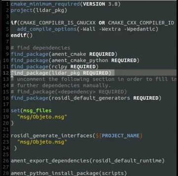
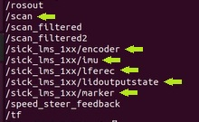
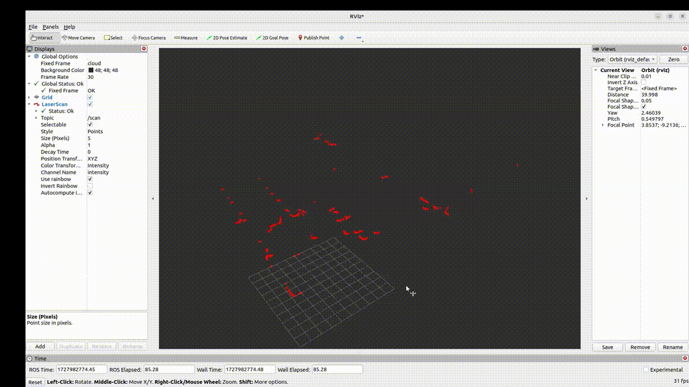

# `Lidar2D`

## 1. Introdução

Este repositório apresenta um projeto de fusão de dados do LiDAR 2D com informações de uma câmera, utilizando ROS2, visando integrar os objetos reconhecidos pelo LiDAR às classificações obtidas pela câmera. O objetivo é aprimorar a detecção e identificação de objetos em ambientes complexos, combinando as vantagens de ambas as tecnologias.

## 2. Estrutura de Pastas
Este Reporsitorio comtem somente o PKG da fusão dos dados do lidar e da camera. Os dados do lidar é proveniente de uma biblioteca da sick, e os da camera vem de um topico explicado em um outro reporsitorio. 
Sendo assim a estrutura a seguir é como deve ficar a workspace referente ao lidar2D.

lidar2d/

├── src/

│     ├── lidar_pkg/

│     │     ├── include/

│     │     ├── msg/

│     │     │     └── Objeto.msg

│     │     ├── scripts/

│     │     │     ├── biblioteca_lidar_camera.py

│     │     │     ├── Lidar_camera_objetos.py

│     │     │     ├── configuracao.cfg

│     │     │     ├── configuracao.md

│     │     │     ├── __init__.py

│     │     │     └── objetos_bb.cfg

│     │     ├── CMakeLists.txt

│     │     └── package.xml

│     ├── libsick_ldmrs/

│     └── sick_scan_xd/

└── README.md

## 3. lidar_pkg
  O pacote lidar_pkg é um package feito para fundir as informações do lidar 2d com os da camera. os testes foram realizados utilizando ROS2 Iron.
  ### 1. Instalação 
  ```bash
  git clone https://github.com/A2Nlu/Lidar2D.git
  ```
  No arquivo CMakeLists.txt comente a linha `find_package(lidar_pkg REQUIRED)`,   pois para o primeiro build do pacote essa linha da erro na compilação do pkg. Use o comando:
    
  ```bash
  cd lidar2d
  colcon build
  ```
  para a compilação do pacote, apos o sucesso da compilação descomente a linha `find_package(lidar_pkg REQUIRED)` do arquivo CMakeLists.txt e repita a compilação.

  

  ### 2. Pacote da SICK
  Para a comunicação com o LIDAR2D e recebimento dos dados, foi utilizado o pacote disponibilizado pela SICK. Para mais informações sobre o pacote acessar o reporsitorio da [SICK](https://github.com/SICKAG/sick_scan_xd?tab=readme-ov-file), ou seguir os seguintes passos:

  ```bash
  cd lidar2d/src
  git clone https://github.com/SICKAG/libsick_ldmrs.git
  git clone -b master https://github.com/SICKAG/sick_scan_xd.git
  popd
  rm -rf ./build ./build_isolated/ ./devel ./devel_isolated/ ./install ./install_isolated/ ./log/
  cd ..
  source /opt/ros/iron/setup.bash # mude a versão do ROS2 conforme necessário
  colcon build --packages-select libsick_ldmrs --event-handlers console_direct+
  source ./install/setup.bash
  colcon build --packages-select sick_scan_xd --cmake-args "-DROS_VERSION=2" --event-handlers console_direct+
  source ./install/setup.bash
  colcon build
  ```
  OBS: faça o build de cada pacote um por vez, espere terminar para ter certeza de que não deu erro na anterior, colocar para fazer uma seguida da outra de uma vez da erro!
  
  Para testar o pacote basta usar o comando: 
  ```bash
  ros2 launch sick_scan_xd sick_lms_1xx.launch.py hostname:=192.168.1.64 
  ```
  Apos iniciar, nos topicos do ros2 deve conter:
  
  
  
  Recomendavel verificar pelo rviz2 a nuvem de pontos.
  
  

  ### 3. Iniciar a aplicação.
  Os passos seguintes não informam a inicialização da câmera, pois conta que tal ja esta funcionando e publicando mensagens em um tópico ros.
  
  Inicie primeiramente o lidar:
  ```bash
  ros2 launch sick_scan_xd sick_lms_1xx.launch.py hostname:=192.168.1.64 
  ```
  Depois o script da fusão
  ```bash
  ros2 run lidar_pkg Lidar_camera_objetos.py
  ```
  Apos iniciar os codigos, nos topicos do ros deve-se ter os do lidar mencionados no item anterior, e os da fusão que são:
  1. /scan_filtred - Publica as distancias filtradas 
  2. /range_ang - Publica as distancias com seus respectivos ângulos 
  3. /objetos_lidar_camera - Publica as informações dos obejtos detectados
  4. /aviso_lidar_camera - Publica um aviso quando o lidar ou a câmera param de mandar informações

  ### 4. Tópico /aviso_lidar_camera
  Neste tópico as mensagens são simples como se observa na Tabela 4, ele serve para quando a câmera ou o Lidar para de mandar informações.

  | Tipo da Variável | Mensagem                              | O que é                                          |
  |------------------|---------------------------------------|--------------------------------------------------|
  | String           | Falha ao receber dados do lidar       | Aviso caso o lidar pare de mandar informações    |
  | String           | Falha ao receber dados da câmera      | Aviso caso a câmera pare de mandar informações   |

  ### 5. Tópico /objetos_lidar_camera
  Este tópico recebe as mensagens de objetos detectados e estão estruturadas conforme a tabela a seguir:
  
  | Tipo da Variável | Nomenclatura         | O que é                                                          |
  |------------------|----------------------|------------------------------------------------------------------|
  | string           | label                | Onde o objeto se encontra/localização geográfica                 |
  | int32            | id                   | Número de identificação do objeto                                |
  | float32          | distancia_central    | Distância do centro do objeto em relação ao lidar em milímetros  |
  | float32          | angulo_central       | Ângulo do centro do objeto em relação ao lidar em graus          |
  | float32          | tamanho_do_objeto    | Tamanho estimado do objeto encontrado em metros em milímetros    |
  | int32            | risco                | Risco que o objeto apresenta em relação ao caminhão              |
  | string           | tipo                 | Tipo do objeto                                                   |

  A localização geográfica do objeto com seu respectivo risco, esta dividida da seguinte forma em relação a frente do caminhão:

  | Localização Geográfica do Objeto                             | Risco |
  |--------------------------------------------------------------|-------|
  | Zona de exclusão (ZE)(até 2 metros)                          | 6     |
  | Túnel 1 (T1)(2 – 10 metros)                                  | 5     |
  | Túnel 2 (T2)(10 – 20 metros)                                 | 4     |
  | Túnel 3 (T3)(20 – 30 metros)                                 | 3     |
  | Túnel 4 (T4)(30 – 40 metros)                                 | 2     |
  | Laterais (LE/LD)(maior que a largura do caminhão, 3 metros)  | 1     |

  ****colocar a imagem ilustrativa da frente do caminhão**

  Quando o tópico recebe as mensagens, elas podem ter: 
  1. Objetos captados pelo lidar, mas não pela câmera;
  2. Objetos detectados pela câmera, mas não captados pelo lidar (neste caso o objeto se encontra a uma altura menor ou maior que a posição que ele se encontra);
  3. Objetos reconhecidos pelo lidar e câmera.
  A tabela a seguir exemplifica os três tipos possiveis da mensagem e o gif de como aparece no terminal. 
  
  | Somente Lidar                   | Somente Câmera              | Lidar e Câmera                |
  |---------------------------------|-----------------------------|-------------------------------|
  | **label:** Tunel 1              | **label:** desconhecido     | **label:** Tunel 2            |
  | **id:** 8                       | **id:** 3                   | **id:** 10                    |
  | **distancia_central:** 3.38952  | **distancia_central:** 5.0  | **distancia_central:** 11.875 |
  | **angulo_central:** -68.5       | **angulo_central:** 58.35   | **angulo_central:** 45.0      |
  | **tamanho_do_objeto:** 0.5876   | **tamanho_do_objeto:** 0.0  | **tamanho_do_objeto:** 0.3521 |
  | **risco:** 5                    | **risco:** 0                | **risco:** 4                  |
  | **tipo:** desconhecido          | **tipo:** chair             | **tipo:** Person              |

  ***add um gif da publicação no topico com a ros bag coletada**

  ### 6. Envio das mensagens dos objetos detectados via CAN
