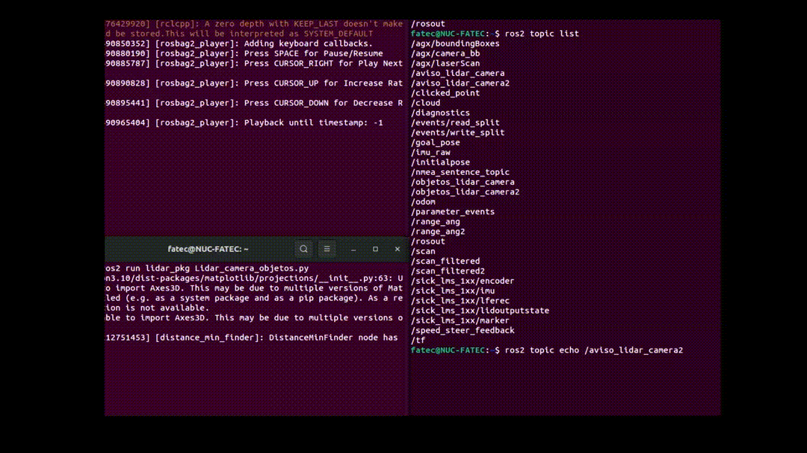
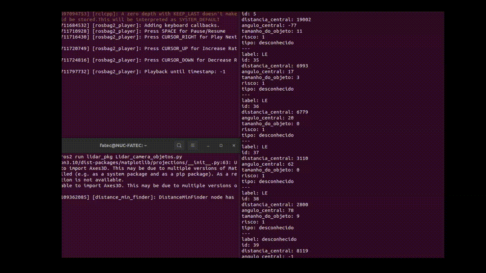
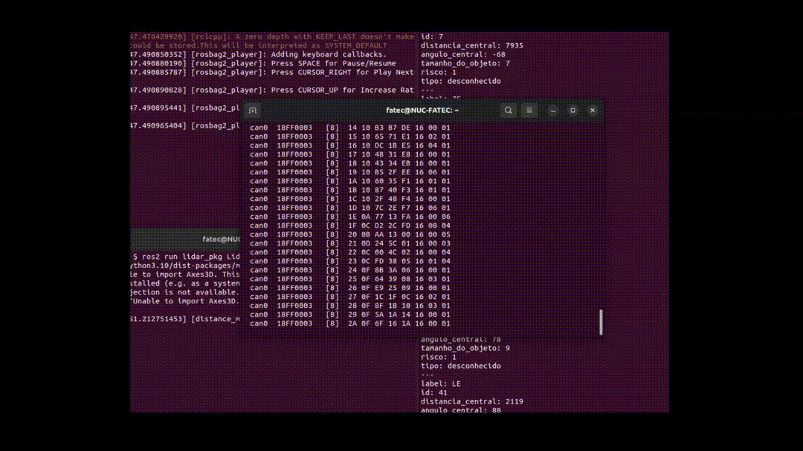

# `Lidar2D`

## 1. Introdução

Este repositório apresenta um projeto de fusão de dados do LiDAR 2D com informações de uma câmera, utilizando ROS2, visando integrar os objetos reconhecidos pelo LiDAR às classificações obtidas pela câmera. O objetivo é aprimorar a detecção e identificação de objetos em ambientes complexos, combinando as vantagens de ambas as tecnologias.

## 2. Estrutura de Pastas
Este repositório contém somente o pacote (PKG) da fusão dos dados do LiDAR e da câmera. Os dados do LiDAR são provenientes de uma biblioteca da Sick, e os dados da câmera vêm de um tópico explicado em outro repositório.

A estrutura a seguir é como deve ficar a workspace referente ao Lidar2D.

lidar2d/

├── src/

│     ├── lidar_pkg/

│     │     ├── include/

│     │     ├── msg/

│     │     │     └── Objeto.msg

│     │     ├── scripts/

│     │     │     ├── biblioteca_lidar_camera.py

│     │     │     ├── Lidar_camera_objetos.py

│     │     │     ├── configuracao.cfg

│     │     │     ├── configuracao.md

│     │     │     ├── __init__.py

│     │     │     └── objetos_bb.cfg

│     │     ├── CMakeLists.txt

│     │     └── package.xml

│     ├── libsick_ldmrs/

│     └── sick_scan_xd/

└── README.md

## 3. lidar_pkg
  O pacote lidar_pkg é um pacote feito para fundir as informações do LiDAR 2D com as da câmera. Os testes foram realizados utilizando ROS2 Iron.
  ### 1. Instalação 
  ```bash
  git clone https://github.com/A2Nlu/Lidar2D.git
  ```
  No arquivo `CMakeLists.txt`, comente a linha `find_package(lidar_pkg REQUIRED)`, pois para o primeiro build do pacote essa linha gera erro na compilação. Use o comando:
    
  ```bash
  cd lidar2d
  colcon build
  ```
  Apos o sucesso da compilação, descomente a linha `find_package(lidar_pkg REQUIRED)` do arquivo CMakeLists.txt e repita a compilação.

  

  ### 2. Pacote da SICK
  Para a comunicação com o LIDAR2D e o recebimento dos dados, foi utilizado o pacote disponibilizado pela SICK. Você pode seguir os seguintes passos para a instalação do pacote usado:
  
  ```bash
  cd lidar2d/src
  git clone https://github.com/SICKAG/libsick_ldmrs.git
  git clone -b master https://github.com/SICKAG/sick_scan_xd.git
  popd
  rm -rf ./build ./build_isolated/ ./devel ./devel_isolated/ ./install ./install_isolated/ ./log/
  cd ..
  source /opt/ros/iron/setup.bash # mude a versão do ROS2 conforme necessário
  colcon build --packages-select libsick_ldmrs --event-handlers console_direct+
  source ./install/setup.bash
  colcon build --packages-select sick_scan_xd --cmake-args "-DROS_VERSION=2" --event-handlers console_direct+
  source ./install/setup.bash
  colcon build
  ```
  OBS: Faça o build de cada pacote um por vez, esperando terminar para ter certeza de que não houve erro na anterior. Tentar compilar todos de uma vez pode causar erros!
  
  Para testar o pacote, basta usar o comando:
  
  ```bash
  ros2 launch sick_scan_xd sick_lms_1xx.launch.py hostname:=192.168.1.64 
  ```
  Após iniciar, nos tópicos do ROS2 devem estar presentes:
  
  
  
  Recomendável verificar pelo RViz2 a nuvem de pontos.
  
  

  Para mais informações sobre o pacote, acesse o reporsitorio da [SICK](https://github.com/SICKAG/sick_scan_xd?tab=readme-ov-file).

  ### 3. Arquivo de configuração
  Este é um arquivo com os parâmetros principais para o funcionamento adequado do programa. Os parâmetros a serem configurados estão na tabela a seguir, com os respectivos valores adotados por padrão. Deve-se respeitar as observações para futuras modificações, se necessário.
  
  |            Parametro             | Valor | observação |
  |----------------------------------|-------|------------|
  |distancia minima                  |  0.1  | A distância mínima não pode ser menor que 0.1.|
  |distancia maxima                  |  40.0 | A distância máxima não pode ser maior que 40. |
  |distancia maxima zona de exclusao |  5.0  | É uma distância crítica próxima ao caminhão; os objetos nessa área representam algum tipo de perigo e devem ser considerados.|
  |largura tunel                     |  1.5  | A largura do túnel é a largura da frente do caminhão; deve-se dividir por 2 essa largura. |
  |tunel1 distancia maxima           |  10.0 | Para configurar os túneis 1, 2, 3 e 4, deve-se considerar o fim do anterior como o início do próximo.|
  |tunel2 distancia maxima           |  20.0 | |
  |tunel3 distancia maxima           |  30.0 ||
  |tunel4 distancia maxima           |  40.0 | Caso queira eliminar o túnel 4, deve-se igualar a distância máxima dos túneis 3 e 4, distribuindo as distâncias nos outros 3 túneis conforme necessário. O ultimo tunel tem o mesmo valor da distancia maxima|
  |centro do objeto para a camera    |  20.0 | O centro do objeto para a câmera deve ser em relação ao Lidar; este parâmetro é um valor em metros da distância de um objeto até o Lidar, onde a altura que o feixe do Lidar pega no objeto deve coincidir com o centro da imagem.|
  |linha                             |   16  |A linha e a coluna são para definir a matriz para fusão dos dados do Lidar e da câmera; a matriz deve ter o número de linhas igual ao de colunas (ex: 32x32, 16x16, 8x8).|
  |coluna                            |   16  |  |
  |distancia euclidiana parametro    |  0.4  | A distância euclidiana é um parâmetro em metros; o padrão está configurado para que, se os pontos tiverem até 0.4 metros de distância entre eles, sejam considerados o mesmo objeto.|
  
  Localizado em: lidar2D/src/lidar_pkg/scripts
  
  arquivo: configuracao.cfg

  ### 4. Iniciar a aplicação.
  Os passos a seguir não informam a inicialização da câmera, pois supõem que ela já está funcionando e publicando mensagens em um tópico ROS.
  
  Inicie primeiramente o lidar:
  ```bash
  ros2 launch sick_scan_xd sick_lms_1xx.launch.py hostname:=192.168.1.64 
  ```
  Depois o script da fusão
  ```bash
  ros2 run lidar_pkg Lidar_camera_objetos.py
  ```
 Após iniciar os códigos, nos tópicos do ROS devem aparecer os do LiDAR mencionados no item anterior e os da fusão, que são:
 
  1. /scan_filtred - Publica as distancias filtradas 
  2. /range_ang - Publica as distancias com seus respectivos ângulos 
  3. /objetos_lidar_camera - Publica as informações dos obejtos detectados
  4. /aviso_lidar_camera - Publica um aviso quando o lidar ou a câmera param de mandar informações

  ### 5. Tópico /aviso_lidar_camera
  Neste tópico, as mensagens são simples, como se observa na Tabela a seguir. Ele serve para quando a câmera ou o Lidar param de enviar informações.

  | Tipo da Variável | Mensagem                              | O que é                                          |
  |------------------|---------------------------------------|--------------------------------------------------|
  | String           | Falha ao receber dados do lidar       | Aviso caso o Lidar pare de mandar informações    |
  | String           | Falha ao receber dados da câmera      | Aviso caso a câmera pare de mandar informações   |

  

  ### 6. Tópico /objetos_lidar_camera
  Este tópico recebe as mensagens de objetos detectados e estão estruturadas conforme a tabela a seguir:
  
  | Tipo da Variável | Nomenclatura         | O que é                                                          |
  |------------------|----------------------|------------------------------------------------------------------|
  | string           | label                | Onde o objeto se encontra/localização geográfica                 |
  | int32            | id                   | Número de identificação do objeto                                |
  | float32          | distancia_central    | Distância do centro do objeto em relação ao Lidar, em milímetros |
  | float32          | angulo_central       | Ângulo do centro do objeto em relação ao Lidar, em graus         |
  | float32          | tamanho_do_objeto    | Tamanho estimado do objeto encontrado, em milímetros             |
  | int32            | risco                | Risco que o objeto apresenta em relação ao caminhão              |
  | string           | tipo                 | Tipo do objeto                                                   |

  A localização geográfica do objeto, juntamente com seu respectivo risco, está dividida da seguinte forma em relação à frente do caminhão:

  | Localização Geográfica do Objeto                             | Risco |
  |--------------------------------------------------------------|-------|
  | Zona de exclusão (ZE)(até 2 metros)                          | 6     |
  | Túnel 1 (T1)(2 – 10 metros)                                  | 5     |
  | Túnel 2 (T2)(10 – 20 metros)                                 | 4     |
  | Túnel 3 (T3)(20 – 30 metros)                                 | 3     |
  | Túnel 4 (T4)(30 – 40 metros)                                 | 2     |
  | Laterais (LE/LD)(maior que a largura do caminhão, 3 metros)  | 1     |
  
  

  Quando o tópico recebe as mensagens, essas podem ser das seguintes formas:
  
  1. Objetos captados pelo lidar, mas não pela câmera;
  2. Objetos detectados pela câmera, mas não captados pelo Lidar (neste caso, o objeto se encontra a uma altura menor ou maior do que a posição em que ele se encontra);
  3. Objetos reconhecidos tanto pelo Lidar quanto pela câmera.
     
  A tabela a seguir exemplifica os três tipos possíveis de mensagem, além de um GIF que mostra como elas aparecem no terminal. 
  
  | Somente Lidar                   | Somente Câmera               | Lidar e Câmera                |
  |---------------------------------|------------------------------|-------------------------------|
  | **label:** T1                   | **label:** DE                | **label:** T2                 |
  | **id:** 8                       | **id:** 3                    | **id:** 10                    |
  | **distancia_central:** 3389     | **distancia_central:** 5000  | **distancia_central:** 1187   |
  | **angulo_central:** -68         | **angulo_central:** 58       | **angulo_central:** 45        |
  | **tamanho_do_objeto:** 587      | **tamanho_do_objeto:** 0     | **tamanho_do_objeto:** 352    |
  | **risco:** 5                    | **risco:** 0                 | **risco:** 4                  |
  | **tipo:** desconhecido          | **tipo:** chair              | **tipo:** Person              |

  

  ### 7. Envio das mensagens dos objetos detectados via CAN
  Uma opção de recebimento dos dados é via CAN, a uma velocidade de 500 kbit, usando a interface PCAN. Os dados foram codificados para envio no barramento, com um tamanho de 8 bytes, seguindo a seguinte estrutura:
  
  |Identificador   |0  | 1              | 2 e 3     | 4      | 5      | 6       | 7     |
  |----------------|---|----------------|-----------|--------|--------|---------|-------|
  |0x18ff3         |ID | Localização    | Distância | Ângulo | Tipo   | Tamanho | Risco |

  **ID:** Numero atribuido ao objeto
  
  **Localização:** Número atribuído para as nomenclaturas da localização geográfica do objeto:
  
  | Localização   | Numero atribuido |
  |---------------|------------------|
  |      ZE       |        10        |
  |      T1       |        11        |
  |      T2       |        12        |
  |      T3       |        13        |
  |      T4       |        14        |
  |      LD       |        15        |
  |      LE       |        16        |
  | Desconhecido  |        17        |

  **Distância:**  Distância do objeto em milímetros, variando de 0 a 65535, sendo limitada a um valor de 40000, pois é a distância máxima alcançada pelo Lidar.
  
  **Ângulo:** O ângulo é dado em graus, podendo ser positivo ou negativo, variando de -128 a 127.
  
  **Tipo:** O tipo do objeto foi separado em objetos fixos (postes, árvores, etc.), objetos móveis (pessoas, caminhão, gato, etc.) e objetos desconhecidos (não reconhecidos pela câmera). Os números atribuídos foram:
  
  |     Tipo      | Numero atribuido |
  |---------------|------------------|
  |      TF       |        20        |
  |      TM       |        21        |
  |      TD       |        22        |
        
  **Tamanho:** O tamanho do objeto está em mm e é um número que originalmente foi dividido por 100 para representação em um intervalo de 0 a 255. Para obter o valor do tamanho do objeto detectado, basta multiplicar por 100.
  
  **Risco:** risco é um numero de 0 á 6 
  

